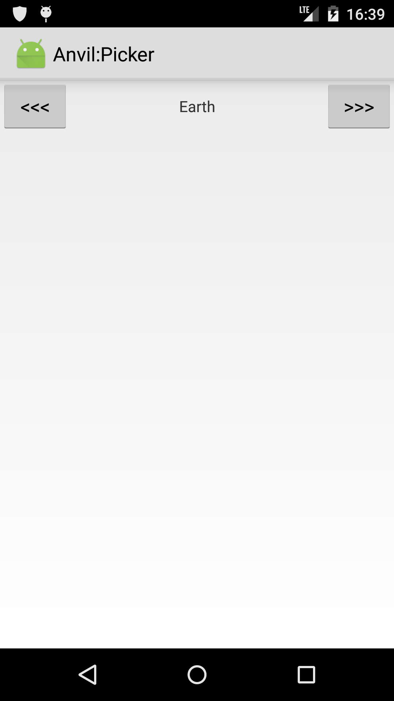
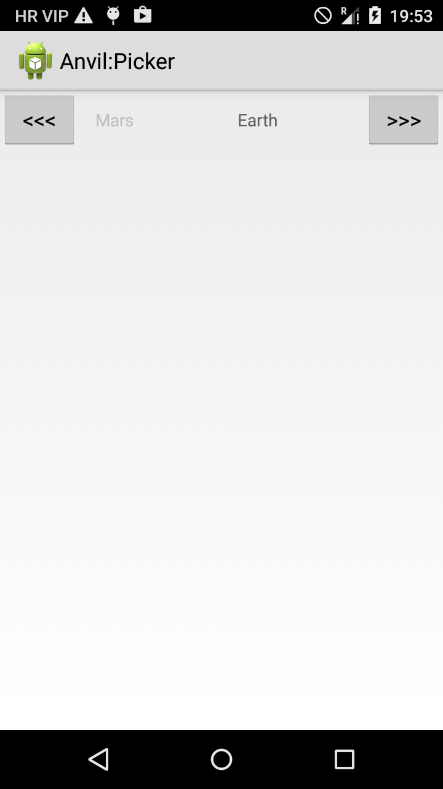

# Picker app

Animated picker written with Anvil.

 

Ok, it's easy to bind left/right buttons and bind centered text view to the
current item in the list. But what about animations? What if a user presses left button twice quickly - we expect the item to be scrolled twice as well.

Animated states to the rescue:

``` java
// State is on when "to the next" animation is happening
State mNext = Anvil.newState(false);

View.OnClickListener mOnNextClicked = (v) -> {
	// On click turn state on for the animation duration
	// Then increment the selected item index, then set state to false
	mNext.set(true, ANIM_DURATION, () -> {
		mIndex = (mIndex + 1) % mItems.length;
	}).set(false, 0);
};


v(....

	// If "to the next" state is on - do animation
	anim(mNext.isOn())
		.of("x", mWidth/4, mWidth*3/4) // scroll right
		.of("alpha", 1f, 0f)           // fade out
		.duration(ANIM_DURATION),

	// if it's not animated at all - the item is centered and is fully opaque
	mNext.isOff() && mPrev.isOff() ? x(mWidth/4) : null,
	mNext.isOff() && mPrev.isOff() ? alpha(1f) : null,
	...);
```


