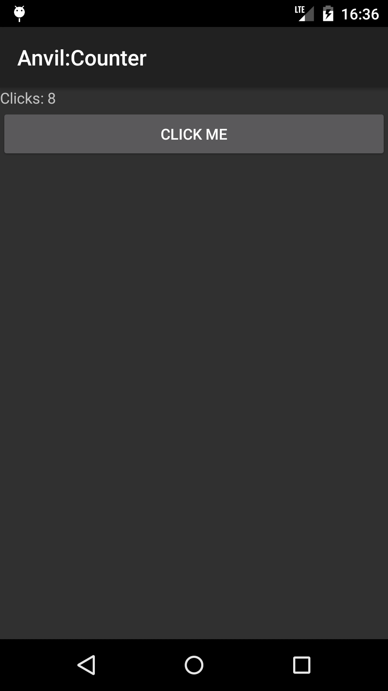

# Counter app

Counter displays a text view and a button and counts the number of button
clicks.



Here's how data binding happens:

``` java
// Data
int mClicks = 0;

// Click listener
View.OnClickListener mOnButtonClicked = new View.OnClickListener() {
	public void onClick(View v) {
		mClicks++;
	}
};

// View layout (updated automatically when data changes)
public ViewNode view() {
	return
		v(LinearLayout.class,
			size(FILL, WRAP),
			orientation(LinearLayout.VERTICAL),

			v(TextView.class,
				text("Clicks: " + mClicks)),

			v(Button.class,
				size(FILL, WRAP),
				text("Click me"),
				onClick(mOnButtonClicked)));
}
```
