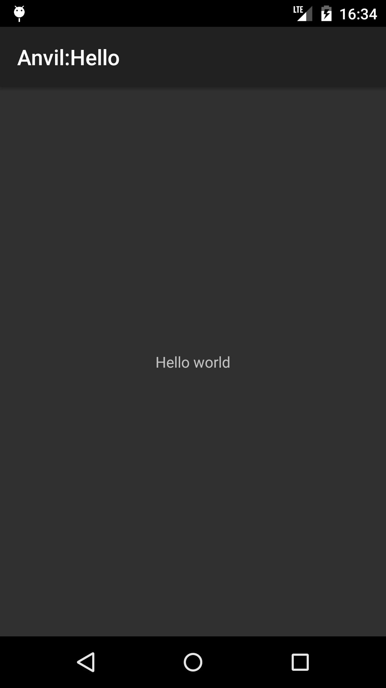

# Hello app

"Hello" is a simple static layout demonstration for Anvil.



Here's the full code of the layout:

``` java
public ViewNode view() {
	return
		v(FrameLayout.class,
			size(FILL, FILL),

			v(TextView.class,
				size(WRAP, WRAP).gravity(CENTER),
				text(R.string.hello)));
}
```
